# Infraestructura completa
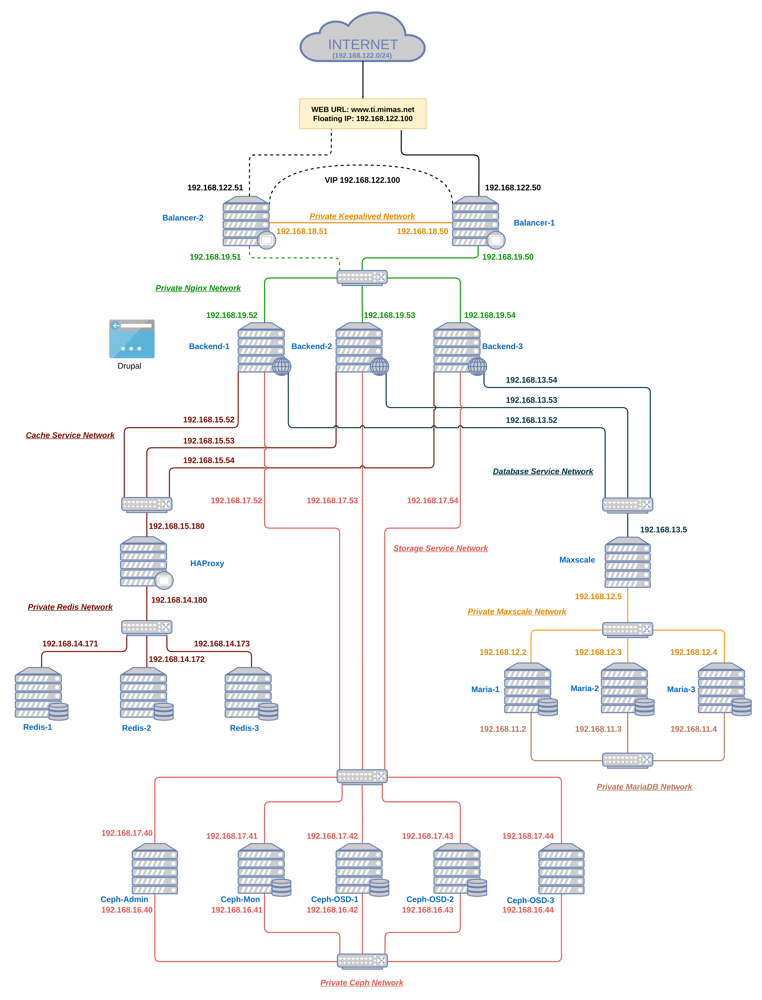

# Configuraciones previas

## Listado de las redes a utilizar

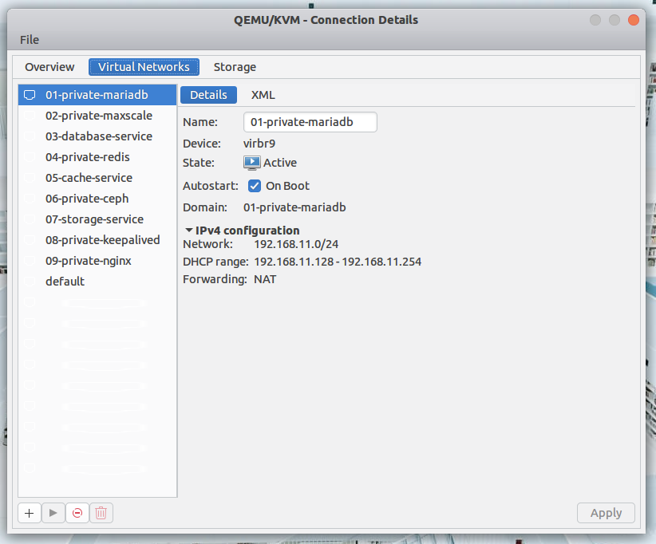

Cada red se ha configurado como NAT para tener acceso a internet.

| Nombre de Red | Direccion IPv4 | Descripción |
| - | - | - |
| 01-private-mariadb | 192.168.11.0/24 | Red para sincronización de los datos entre los servidores de mariadb |
| 02-private-maxscale | 192.168.12.0/24 | Red de comunicación entre el balanceador y los nodos de base de datos | 
| 03-database-service | 192.168.13.0/24 | Red pública por la cual habrá comunicación entre los clientes y el clúster | 
| 04-private-redis | 192.168.14.0/24 | Red publica de para que los clientes consuman el servicio de redis |
| 05-cache-service | 192.168.15.0/24 | Red de comunicacion de los nodos redis |

## Listado de maquinas virtuales con sistema opertaivo ubuntu 22.04
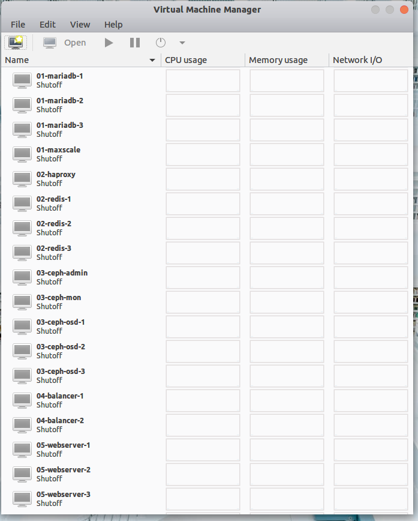

Caracteristicas de las maquinas virtuales

| Nombre | Requisitos Minimos |
| - | - |
| Maxscale | 1GB RAM, 2CPU, 15GB Storage |
| Maria-1 | 1GB RAM, 2CPU, 15GB Storage |
| Maria-2 | 1GB RAM, 2CPU, 15GB Storage |
| Maria-3 | 1GB RAM, 2CPU, 15GB Storage |
| HAProxy | 1GB RAM, 2CPU, 15GB Storage |
| Redis-1 | 1GB RAM, 2CPU, 15GB Storage |
| Redis-2 | 1GB RAM, 2CPU, 15GB Storage |
| Redis-3 | 1GB RAM, 2CPU, 15GB Storage |

# Cluster de Base de Datos

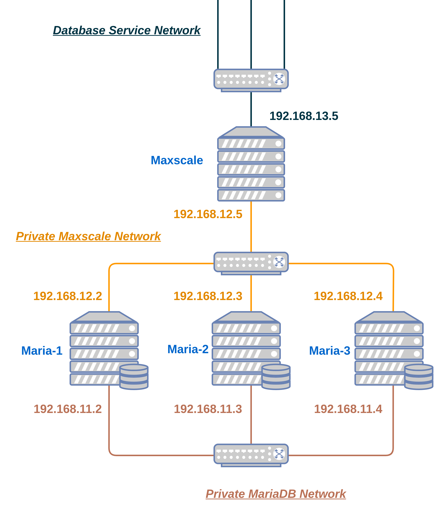

Asignación de direcciones IP de los nodos:

| Nodo | Interfaz | IP |
| - | - | - |
| maxscale | enp1s0 | 192.168.13.5 |
| maxscale | enp2s0 | 192.168.11.5 |
| maria-1 | enp1s0 | 192.168.12.2 |
| maria-1 | enp2s0 | 192.168.11.2 |
| maria-2 | enp1s0 | 192.168.12.3 |
| maria-2 | enp2s0 | 192.168.11.3 |
| maria-3 | enp1s0 | 192.168.12.4 |
| maria-3 | enp2s0 | 192.168.11.4 |
| haproxy | enp1s0 | 192.168.15.180 |
| haproxy | enp2s0 | 192.168.14.180 |
| redis-1 | enp1s0 | 192.168.14.171 |
| redis-2 | enp1s0 | 192.168.14.172 |
| redis-3 | enp1s0 | 192.168.14.173 |


## Configuracion previa

### Interfaces

Para configurar las direcciones IP de las maquinas hay que editar el archivo de netplan.
```bash
sudo nano /etc/netplan/00-installer-config.yaml
```

Modificar el archivo para que quede de la siguiente manera teniendo en cuenta la indentación ya que es un archivo yaml. Modificar la direccion IP para cada nodo.
```yaml
network:
  version: 2
  renderer: networkd
  ethernets:
    enp1s0:
      addresses:
        - 192.168.11.3/24
      routes:
        - to: default
          via: 192.168.11.1
      nameservers:
        addresses: [192.168.11.1]
    enp7s0:
      addresses:
        - 192.168.12.3/24
      routes:
        - to: 192.168.12.0/24
          via: 192.168.12.1
```

### Hostname
Ya que vamos a estar trabajando con varias maquias virtuales, es recomendado cambiar el hostname a todas para saber en todo momento, en que nodo estamos trabajando.
```bash
#Para el nodo maria-1
sudo hostnamectl set-hostname maria-1 && exec bash

#Para el nodo maria-2
sudo hostnamectl set-hostname maria-2 && exec bash

#Para el nodo maria-3
sudo hostnamectl set-hostname maria-3 && exec bash

#Para el nodo maxscale
sudo hostnamectl set-hostname maxscale && exec bash
```

### Archivo hosts
Para utilizar nombres de los nodos en lugar de direcciones IP en las configuraciones a realizar, los configuramos en el archivo hosts.
```bash
sudo nano /etc/hosts
```
Agregar las siguientes líneas en el archivo hosts de los nodos de mariadb:
```lua
192.168.11.2 maria-1
192.168.11.3 maria-2
192.168.11.4 maria-3
```

Agregar las siguientes líneas en el archivo hosts de maxscale:
```lua
192.168.13.5 maxscale
192.168.12.2 maria-1
192.168.12.3 maria-2
192.168.12.4 maria-3
```

### Configuración del repositorio
Agregar los repositorios de mariadb a la lista de repositorios de Ubuntu en las **4 máquinas virtuales** ya que los paquetes de mariadb y maxscale están en los repositorios de mariadb:

```bash
curl -LsS https://r.mariadb.com/downloads/mariadb_repo_setup | sudo bash
```

Una vez configurado el repositorio actualizar los paquetes e instalar los paquetes necesarios **en los nodos de mariadb**.
```bash
sudo apt update
sudo apt install mariadb-server -y
```
## Configuración del cluster de Mariadb
Este paso se realiza en **los nodos de MariaDB** para configurarlos como un clúster.
Creamos el archivo de configuración del clúster.
```bash
sudo nano /etc/mysql/conf.d/mariadb.cnf
```

El archivo debe tener el siguiente contenido:
```bash
[mysqld]
query_cache_size=0
binlog_format=ROW
default-storage-engine=innodb
innodb_autoinc_lock_mode=2
query_cache_type=0
bind-address=0.0.0.0
wsrep_on=ON 
wsrep_provider=/usr/lib/galera/libgalera_smm.so

wsrep_cluster_name="ClusterMaria"
wsrep_cluster_address="gcomm://192.168.11.2,192.168.11.3,192.168.11.4"
wsrep_sst_method=rsync
wsrep_node_address="192.168.11.2"
wsrep_node_name="maria-1"
```

Modificar las lineas `wsrep_node_name` y `wsrep_node_address` dependiendo el nodo.

Modificar el archivo del servidor de mariadb para escuchar en la interfaz correspondiente.
```bash
sudo nano /etc/mysql/mariadb.conf.d/50-server.cnf
```

Modificar la line 27 con la IP donde escucha el servicio **en cada uno de los nodos mariadb**:
```php
bind-address            = 192.168.12.2
```

### Inicialización del Cluster
Iniciarlizar el cluster desde **unicamente un nodo del cluster**.
```bash
sudo galera_new_cluster
```
El comando no da salida por consola.

Si no hay ningún error, revisamos el estado del servicio.
```bash
sudo service mariadb status
```
Si le muestra que MariaDB está corriendo, esto quiere decir que arrancó con éxito el clúster, entonces podrá revisar el estado del clúster en cuanto a los nodos con la siguiente orden:  
(solicita la clave de root)

```bash
sudo mariadb -u root -p -e "SHOW STATUS LIKE 'wsrep_cluster_size'"
```

Si todo esta correcto debe mostrar la siguiente salida:
```bash
ponce020@maria-1:~$ sudo mariadb -u root -p -e "SHOW STATUS LIKE 'wsrep_cluster_size'"
Enter password: 
+--------------------+-------+
| Variable_name      | Value |
+--------------------+-------+
| wsrep_cluster_size | 1     |
+--------------------+-------+
```

Lo anterior indica que solo hay un servidor de mariadb en el clúster el cual es el mismo donde se acaba de iniciaizar. 

Una vez el cluster funcionando reiniciar el servicio **en los otros nodos** para unirse al cluster.
```bash
sudo service mariadb restart
```

### Reinicio del clúster cuando se apagan todas las maquinas
Cuando se apagan todas las máquinas virtuales y se vuelven a encenderlas, el clúster está detenido porque hay que revisar que nodo tiene los últimos cambios o registros. Para eso hay dos formas:
1. Revisa el archivo /var/lib/mysql/grastate.dat
2. Usar el comando galera_recovery

En el primer caso, se debe revisar el archivo grastate.dat en todos los nodos y el cual tenga la línea `safe_to_bootstrap: 1` es el nodo en el cual debemos reiniciar el clúster. En la imagens e puede ver que el nodo maria-2 es el que tiene en 1 el valor de safe_to_bootstrap por lo que es en ese nodo donde se debe levantar el cluster.

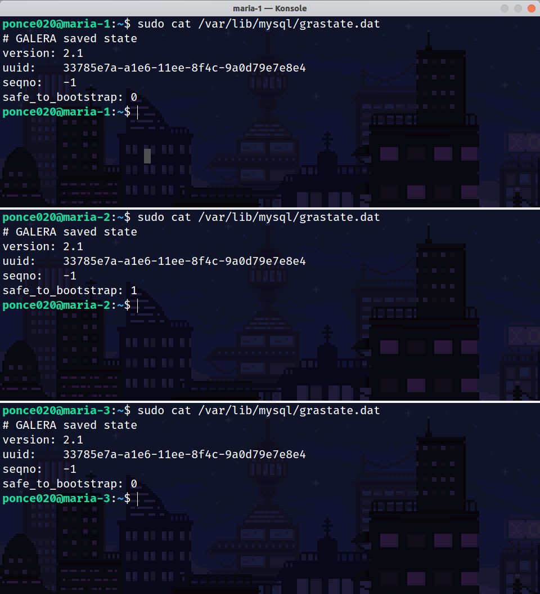

En el segundo caso, se debe ejecutar el comando `sudo galera_recovery` en todos los nodos y revisar la salida. El nodo que devuelva el mayor número entero es el nodo que debemos usar para iniciar el clúster.

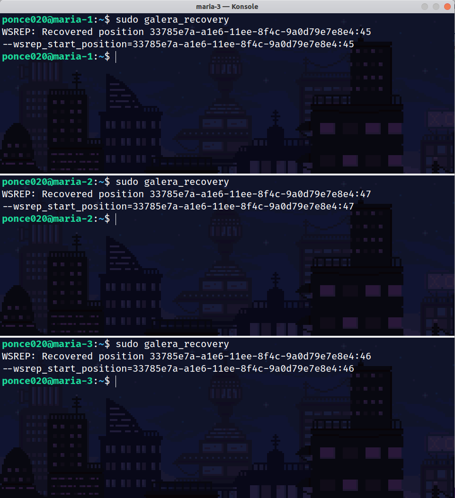

Conociendo el nodo correcto , se debe correr el siguiente comando para levantar el clúster teniendo en cuenta que el clúster no esté en operación.
```bash
sudo galera_new_cluster
```

Una vez se ejecute el comando **en el nodo correcto**, resta reiniciar el servicio de mariadb en **todos los otros nodos** para que se integren de nuevo al clúster.
```bash
sudo service mariadb restart
```

## Configuración de Balanceador
### Instalación de paquetes
Ya habiendo agregado el repositorio de mariadb instalamos maxscale:
```bash
sudo apt install maxscale -y
```

### Configuración del usuario para maxscale
Debe crearse un usuario en la base de datos y configurarlo para que haga el monitoreo y las peticiones al clúster.
Si ya está en funcionamiento el clúster, solo es necesario realizar los siguientes pasos en **un nodo del clúster** y se repicará a los demás:

Ingresamos a la CLI de mariadb/mysql
```bash
sudo mariadb
```

Cree el usuario MaxScale y asigne los permisos sobre las diferentes acciones.
```sql
CREATE USER 'maxscale'@'%' IDENTIFIED BY 'ultrasecreta';
GRANT SELECT ON mysql.user TO 'maxscale'@'%';
GRANT SELECT ON mysql.db TO 'maxscale'@'%';
GRANT SELECT ON mysql.tables_priv TO 'maxscale'@'%';
GRANT SELECT ON mysql.columns_priv TO 'maxscale'@'%';
GRANT SELECT ON mysql.proxies_priv TO 'maxscale'@'%';
GRANT SELECT ON mysql.procs_priv TO 'maxscale'@'%';
GRANT SELECT ON mysql.roles_mapping TO 'maxscale'@'%';
GRANT SHOW DATABASES ON *.* TO 'maxscale'@'%';
GRANT REPLICATION CLIENT on *.* to 'maxscale'@'%';
GRANT ALL ON infinidb_vtable.* TO 'maxscale'@'%';
```

### Configuración del servicio
Editar el archivo `/etc/maxscale.cnf`:

```bash
sudo nano /etc/maxscale.cnf
```

El contenido debe ser el siguiente:

```ini
[maxscale]
threads=auto
log_augmentation = 1
ms_timestamp = 1
syslog = 1
admin_host=0.0.0.0  
admin_secure_gui=false

[maria-1]
type=server
address=192.168.12.2
port=3306
protocol=MariaDBBackend

[maria-2]
type=server
address=192.168.12.3
port=3306
protocol=MariaDBBackend

[maria-3]
type=server
address=192.168.12.4
port=3306
protocol=MariaDBBackend

[Galera-Monitor]
type=monitor
module=galeramon
servers=maria-1,maria-2,maria-3
user=maxscale
password=ultrasecreta
monitor_interval=2000ms

[Read-Con-Route-Galera-Service]
type=service
router=readconnroute
servers=maria-1,maria-2,maria-3
user=maxscale
password=ultrasecreta

[Read-Con-Route-Galera-Listener]
type=listener
service=Read-Con-Route-Galera-Service
protocol=MariaDBClient
port=3306
address=192.168.13.5
```

Inicializar el servicio
```bash
sudo service maxscale start
```

Debe mostrar la siguiente salida de consola:
```bash
ponce020@maxscale:~$ sudo maxctrl list servers
┌─────────┬──────────────┬──────┬─────────────┬─────────────────────────┬──────┬────────────────┐
│ Server  │ Address      │ Port │ Connections │ State                   │ GTID │ Monitor        │
├─────────┼──────────────┼──────┼─────────────┼─────────────────────────┼──────┼────────────────┤
│ maria-1 │ 192.168.12.2 │ 3306 │ 0           │ Slave, Synced, Running  │      │ Galera-Monitor │
├─────────┼──────────────┼──────┼─────────────┼─────────────────────────┼──────┼────────────────┤
│ maria-2 │ 192.168.12.3 │ 3306 │ 0           │ Master, Synced, Running │      │ Galera-Monitor │
├─────────┼──────────────┼──────┼─────────────┼─────────────────────────┼──────┼────────────────┤
│ maria-3 │ 192.168.12.4 │ 3306 │ 0           │ Slave, Synced, Running  │      │ Galera-Monitor │
└─────────┴──────────────┴──────┴─────────────┴─────────────────────────┴──────┴────────────────┘
```

La configuracion realizada cuenta con un panel de administracion web por el puerto 8989. El usuario por defecto es `admin` y la contraseña es `mariadb`.

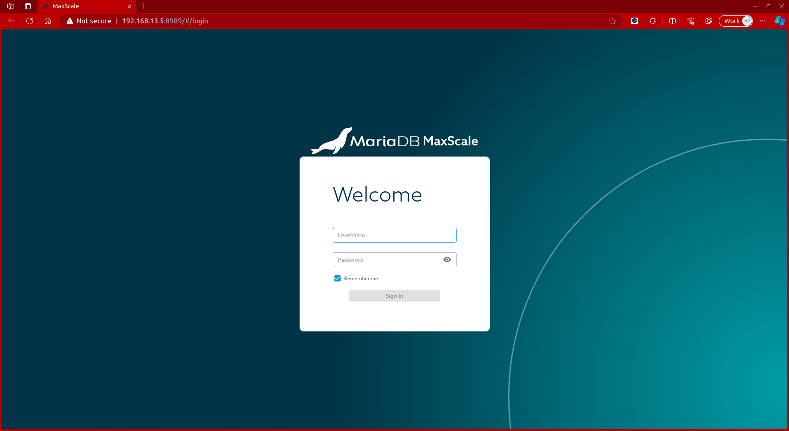

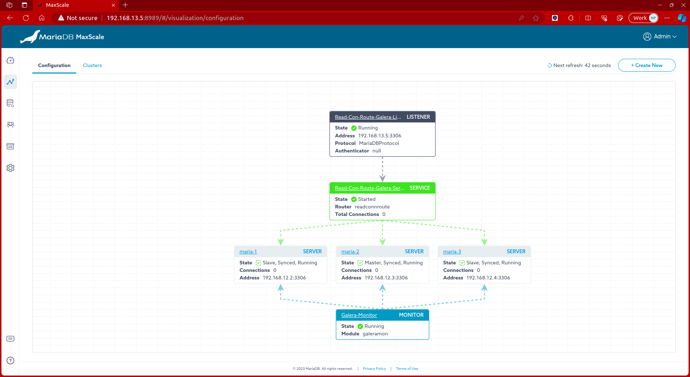

# Cluster de Redis

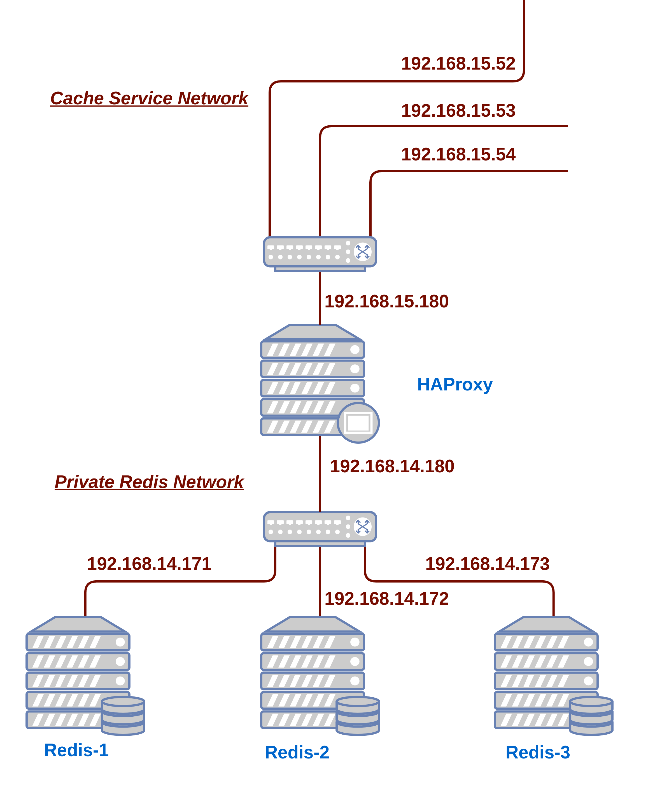

Asignación de direcciones IP de los nodos:

| Nodo | Interfaz | IP |
| - | - | - |
| haproxy | enp1s0 | 192.168.15.180 |
| haproxy | enp2s0 | 192.168.14.180 |
| redis-1 | enp1s0 | 192.168.14.171 |
| redis-2 | enp1s0 | 192.168.14.172 |
| redis-3 | enp1s0 | 192.168.14.173 |


## Configuracion previa

### Interfaces

Para configurar las direcciones IP de las maquinas hay que editar el archivo de netplan.
```bash
sudo nano /etc/netplan/00-installer-config.yaml
```

Modificar el archivo para que quede de la siguiente manera teniendo en cuenta la indentación ya que es un archivo yaml. Modificar la direccion IP para cada nodo. Para los nodos redis solo basta con tener una interfaz.
```yaml
network:
  version: 2
  renderer: networkd
  ethernets:
    enp1s0:
      addresses:
        - 192.168.15.180/24 
      routes:
        - to: default
          via: 192.168.15.1
      nameservers:
        addresses: [192.168.15.1]
    enp2s0:
      addresses:
        - 192.168.14.180/24
      routes:
        - to: 192.168.14.0/24
          via: 192.168.14.1
```

### Hostname
Ya que vamos a estar trabajando con varias maquias virtuales, es recomendado cambiar el hostname a todas para saber en todo momento, en que nodo estamos trabajando.
```bash
#Para el nodo maria-1
sudo hostnamectl set-hostname redis-1 && exec bash

#Para el nodo maria-2
sudo hostnamectl set-hostname redis-2 && exec bash

#Para el nodo maria-3
sudo hostnamectl set-hostname redis-3 && exec bash

#Para el nodo maxscale
sudo hostnamectl set-hostname haproxy && exec bash
```

### Archivo hosts
Para utilizar nombres de los nodos en lugar de direcciones IP en las configuraciones a realizar, los configuramos en el archivo hosts.
```bash
sudo nano /etc/hosts
```
Agregar las siguientes líneas en el archivo hosts de los nodos de mariadb:
```lua
192.168.14.171 redis-1
192.168.14.172 redis-2
192.168.14.173 redis-3
```

## Configuracion de los Nodos Redis
### Instalacion de paquetes
Agregamos los repsitorios de redis a la lista de repositorios de ubuntu para tener loss paquetes mas actualizados.
```bash
curl -fsSL https://packages.redis.io/gpg | sudo gpg --dearmor -o /usr/share/keyrings/redis-archive-keyring.gpg

echo "deb [signed-by=/usr/share/keyrings/redis-archive-keyring.gpg] https://packages.redis.io/deb $(lsb_release -cs) main" | sudo tee /etc/apt/sources.list.d/redis.list
```

Una vez configurado los repositorios actualizar el indice de paquetes e instalacion de redis y sentinel
```bash
sudo apt update
sudo apt install redis redis-sentinel -y
```

Habilitar el inicio de los servicios con el sistema
```bash
sudo systemctl enable redis-server
sudo systemctl enable redis-sentinel
```

Se detiene los servicios temporalmente
```bash
sudo service redis-server stop
sudo service redis-sentinel stop
```

### Configuracion del servicio de Redis Server
Editar archivo de configuracion de redis-server
```bash
sudo nano /etc/redis/redis.conf
```

Modificamos las siguientes lineas del archivo en el nodo que servirá como maestro al inicio (linea 68 y 87):
```php
bind 192.168.14.171 127.0.0.1
protected-mode no
```

En los nodos que inicialmente seran esclavos, modificar las lineas:
```php
bind 192.168.14.172 127.0.0.1 // 192.168.14.173 en el nodo redis-3
protected-mode no
slaveof 192.168.14.171 6379
```

### Configuracion del servicio de Redis Sentinel
Modificamos el archivo de configuracion de redis-sentinel
```bash
sudo nano /etc/redis/sentinel.conf
```

En todos los nodos redis debe tener el siguiente contenido:
```php
protected-mode no  
port 26379  
daemonize yes  
supervised systemd  
pidfile "/run/sentinel/redis-sentinel.pid"  
logfile "/var/log/redis/redis-sentinel.log"  
dir "/var/lib/redis"  
sentinel monitor mymaster 192.168.14.171 6379 2  // importante poner esta linea primero
sentinel down-after-milliseconds mymaster 5000  //viene comentada por defecto
acllog-max-len 128  
sentinel failover-timeout mymaster 10000  // viene conectada por defecto
sentinel deny-scripts-reconfig yes  
```

### Inicializacion de los servicios
Ya que los servicios se inicializan al instalar los paquetes, debemos reiniciar los servicios
```bash
sudo service redis-server restart
sudo service redis-sentinel restart
```

### Prueba de replicacion
Para probar que la replicacion de la informacion está funcionado debemos saber que rol ejecuta cada uno de los nodos. Para eso ejecutamos el siguiente comando:
```bash
redis-cli -p 6379 info replication | grep role
```

Debemos saber el nodo que inicialmente está sirviendo como master. Debe devolver lo siguiente:
```php
role:master
```

Los otros nodos deben devolver:
```php
role:slave
```

En el nodo master debemos ingresar una llave, ya que es el unico en el que se puede escribir informacion.
```bash
redis-cli set my-key "Hola Mundo"
```

Ahora en los nodos esclavos debemos obtener la llave ejecutando el comando:
```bash
redis-cli get my-key
```

Si se muestra "Hola Mundo" entonces la replicacion está funcionando correctamente.

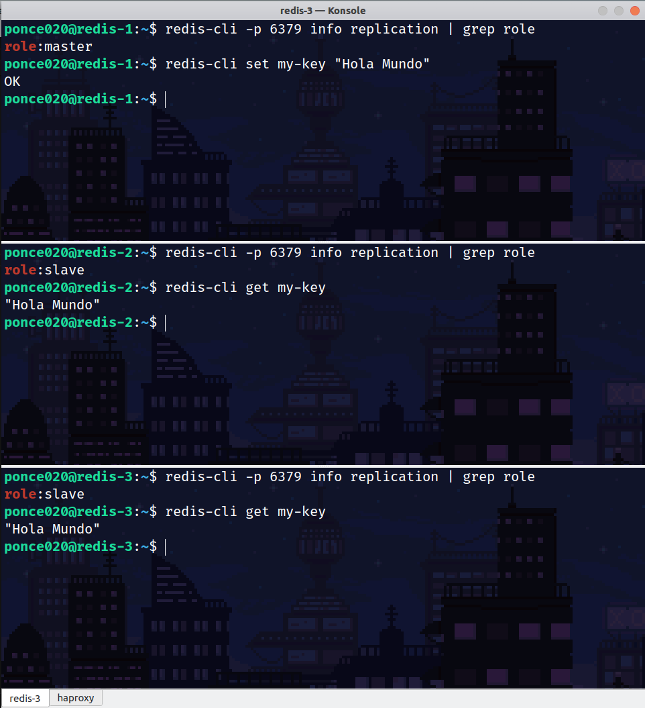


## Configuracion de HAProxy
### Instalacion del paquete
El paquete de balanceo es haproxy:
```bash
sudo apt install haproxy -y
```

### Configurando el servicio
Se va a configrar haproxy para estar continuamente preguntando a los nodos de redis, cual es el maestro para poder escribir los datos que vengan de los cleintes en el nodo correcto.

Editamos el archivo:
```bash
sudo nano /etc/haproxy/haproxy.cfg
```

Borramos el contenido y escribimos el siguiente nuevo contenido:
```php
defaults REDIS
    mode tcp
    timeout connect 3s
    timeout server 6s
    timeout client 6s

frontend http
        bind :8080
        default_backend stats


backend stats
        mode http
        stats enable
        stats uri /
        stats refresh 1s
        stats show-legends
        stats admin if TRUE

frontend ft_redis
    bind 192.168.15.180:6379 name redis
    default_backend bk_redis

backend bk_redis
    option tcp-check
    tcp-check connect
    tcp-check send PING\r\n
    tcp-check expect string +PONG
    tcp-check send info\ replication\r\n
    tcp-check expect string role:master
    tcp-check send QUIT\r\n
    tcp-check expect string +OK
    server redis-1 192.168.14.171:6379 check inter 1s
    server redis-2 192.168.14.172:6379 check inter 1s
    server redis-3 192.168.14.173:6379 check inter 1s

backend redis-online
        mode tcp
        balance roundrobin
        option tcp-check

        tcp-check send PING\r\n
        tcp-check expect string +PONG

        server redis-1:192.168.14.171:6379 192.168.14.171:6379 maxconn 1024 check inter 1s
        server redis-2:192.168.14.172:6379 192.168.14.172:6379 maxconn 1024 check inter 1s
        server redis-3:192.168.14.173:6379 192.168.14.173:6379 maxconn 1024 check inter 1s
```

Reiniciamos el servcio para correr el servicio con la nueva configuracion
```bash
sudo systemctl restart haproxy
```

En el cuadro bk_redis se muestra en verde el nodo que esta sirviendo como master y en rojo los que son slave.
En el cuadro redis-online vemos el estado de los nodos sin importar el rol. Se muestran en verde los que estan activos. Si un nodo se apaga se mostrara en rojo.

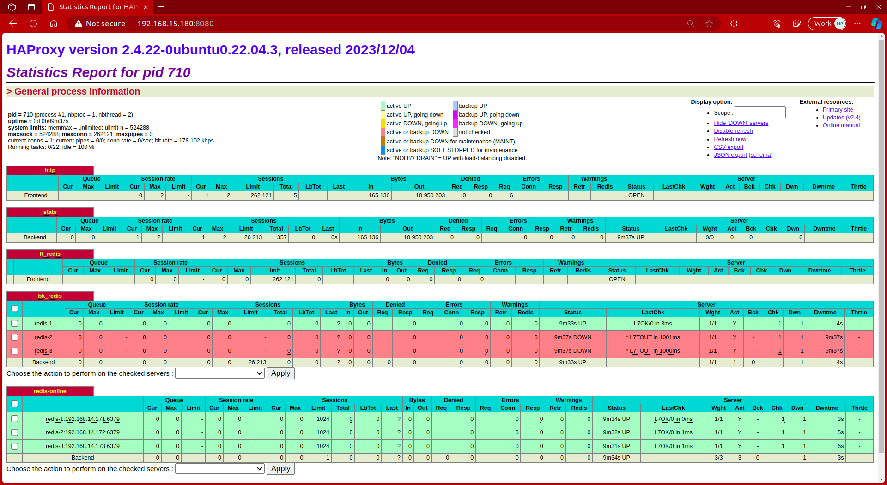
